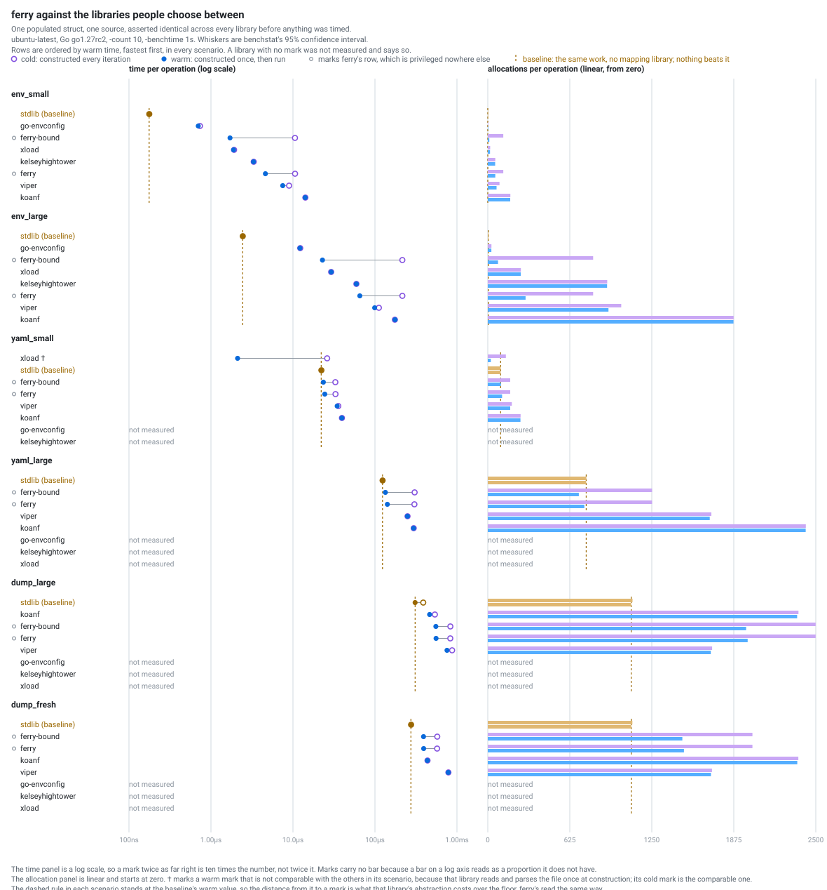

<p align="center">
  
</p>

<h1 align="center">ferry</h1>

<p align="center">Two-way data mapping for Go structs: load from any source, dump to any sink.</p>

[](https://github.com/onhotpath/ferry/actions/workflows/ci.yml)
[](https://codecov.io/gh/onhotpath/ferry)
[](https://pkg.go.dev/github.com/onhotpath/ferry)

One annotated struct, one tag grammar, two directions.
The same `Config` type reads from a YAML file, from environment variables, and from a Consul-shaped key-value store, and writes back to any of them that can be written to.

```
go get github.com/onhotpath/ferry
go get github.com/onhotpath/ferry/driver/yaml
```

## A worked example

```go
type Config struct {
	Name    string        `ferry:"name,required"`
	Timeout time.Duration `ferry:"timeout,default=30s"`
	DB      DB            `ferry:"db"`
	Tags    []string      `ferry:"tags"`
}

type DB struct {
	Host string `ferry:"host"`
	Port int    `ferry:"port,default=5432"`
}
```

Given `app.yaml`:

```yaml
# the service this config is for
name: checkout
db:
  host: db.internal
tags:
  - a
```

load it, change something, and write it back:

```go
cfg, err := ferry.Load[Config](ctx, yaml.NewSource("app.yaml"))
// {Name:checkout Timeout:30s DB:{Host:db.internal Port:5432} Tags:[a]}

cfg.Tags = append(cfg.Tags, "b")

err = ferry.Dump(ctx, cfg, yaml.NewSink("app.yaml"))
```

The file afterwards:

```yaml
# the service this config is for
name: checkout
db:
  host: db.internal
  port: 5432
tags:
  - a
  - b
timeout: 30s
```

The comment survived, and so did the key order.
Saving edits the file rather than replacing it, so only the keys your struct names are touched.

`timeout` was written because the field holds a value, and `port` because a default was applied on the way in.
A default is applied when the plane holds nothing at that address, and it is text parsed by exactly the parser that field's own kind uses, so `default=30s` and a `timeout: 30s` in the file mean the same thing (ADR-0006).

## Why it exists

Most Go configuration libraries go one way.
They fill a struct from somewhere and stop, so writing the same struct back means a second set of tags, a second mapping, and a second place for the two to drift apart.

ferry drives both directions off one annotation, over a backend it has no opinion about.
Three things follow from that rather than being features bolted on top:

- **A config file a person maintains stays one.**
  A save through `driver/yaml` edits the document in place, so comments, key order and keys your struct does not map all survive.
- **Plane-to-plane transfer is free.**
  Load from one source and dump to another sink, with no intermediate format: a YAML file into a KV store is two calls.
  [`examples/planetransfer`](examples/planetransfer/) is the runnable version, and it names what the trip through the struct costs.
- **A backend is two methods.**
  `Bind` is handed the address set your type determined, and the function it returns does the I/O.
  Nothing else is required, and the conformance suite that proves you got it right is one call.

## Drivers

| module | plane | directions |
| --- | --- | --- |
| [`driver/env`](driver/env/) | environment variables, layered over `.env` files | load and dump |
| [`driver/yaml`](driver/yaml/) | a YAML file, edited in place | load and dump |
| [`driver/kv`](driver/kv/) | a Consul-shaped key-value store, client supplied by you | load and dump, experimental |
| [`driver/http`](driver/http/) | one HTTP request's query parameters or header fields | load |
| [`driver/windows`](driver/windows/winreg/) | the Windows registry | load and dump, experimental |

Each is a module of its own, versioned separately, and each has a README of its own behind the link.
Loading and dumping are separate interfaces, so a source with no honest write - environment variables are the case - is a compile error at the `ferry.Dump` call site rather than a runtime refusal.

Anything else is [a driver you write](docs/guide/drivers.md).

## The six verbs and the two options

```go
cfg, err := ferry.Load[Config](ctx, src)       // build a fresh Config from a source
cfg, err := ferry.LoadOver(ctx, seed, src)     // load over a value that already holds some
err = ferry.Dump(ctx, cfg, sink)               // write a value to a sink
err = ferry.Compile[Config]()                  // check the type maps, with no plane in sight

b, err := ferry.Bind[Config](src)              // hand the source the addresses once
cfg, err := b.Load(ctx)                        // ... and load through it as often as you like

w, err := ferry.BindSink[Config](sink)         // the same split on the write side
err = w.Dump(ctx, cfg)
```

`Load` is `Bind` plus one method with the handle dropped, and `Dump` is `BindSink` plus one method, so a program that never holds a binding writes exactly what it wrote before.
Hold one where the plane is per request, or where the same load runs on a timer: the compile and the driver's own bind happen once instead of on every call.
A binding is safe to use from many goroutines.

`ferry.TagKey("env")` changes which struct tag key is read.
It applies to every struct in that call, so pass it everywhere you load that type.

`ferry.WithRegistry(reg)` names a registry other than the one core ships.
`ferry.NewRegistry(codecs...)` builds one and reports what it refused: it takes its whole codec set at once, holds core's own type set underneath, and has no mutators, so it is complete on the line it is born.
`ferry.MustRegistry(codecs...)` is the same thing for a package-level var, and panics where the other returns an error.
A registry also caches the compiled schema, so it is a value to keep: one per program, or one per test.

## Documentation

The guides under [`docs/guide/`](docs/guide/) are the long-form documentation:

- [The supported type set](docs/guide/types.md) - every type ferry carries, in one table, and the sharp edges that are easier to meet in production than to guess at from the rules.
- [Tags, defaults and absence](docs/guide/tags.md) - the whole tag grammar, and what `Absent` and `Null` mean to a Go field.
- [Errors](docs/guide/errors.md) - what a failed call carries, how to match on it, and why the message text is not API.
- [Plane compatibility](docs/guide/compatibility.md) - the second promise ferry makes, its three tiers, and what a representation change costs.
- [The dump lifecycle](docs/guide/dump-lifecycle.md) - the seven stages of a `Dump` call, and the ladder of what refuses where.
- [Writing a driver](docs/guide/drivers.md) - the two required methods, the eight optional interfaces, and the one-call conformance suite.
- [Concurrency](docs/guide/concurrency.md) - the two axes, the one budget both layers honour, and what stays serial.
- [Watch and reload](docs/guide/watch-reload.md) - why a reload is a `Load`, and the sharp edges a watch loop inherits.

The design records behind every one of these decisions are in [`docs/adr/`](docs/adr/).
The ADRs are the specification: where a guide and an ADR disagree, the ADR wins and the guide is wrong.
Start with [ADR-0001](docs/adr/0001-what-ferry-supports.md) for what ferry supports and what is ruled out, then [ADR-0010](docs/adr/0010-the-entry-point-and-the-schema-cache.md) for the shape a caller sees.

Package documentation is on [pkg.go.dev](https://pkg.go.dev/github.com/onhotpath/ferry).

## Status

**v0, and deliberately so.**
v0 is the only place semver allows a decision to be taken back, and ferry is using it (ADR-0002).
Both the Go API and the text ferry writes into a plane are still free to move.
The trigger for v1 is the tag grammar surviving real use, and the golden table that pins what a plane holds settling (ADR-0013).

**The Go floor is 1.27**, declared by every module in this repository.
Go 1.27 is not GA at the time of writing: `go1.27rc2` is what exists, and it is what this repository's `go.work` pins.
ferry uses `errors.AsType` and the 1.27 standard library, and core takes no non-stdlib dependency at all.

## Performance

<!-- ferry:perf:begin -->
Measured, not claimed.
The table is machine-generated from a benchmark run; the harness refuses to run at
all unless every library produces the identical struct from the identical source.

The baseline is the same job written out by hand with no mapping layer over it, and it is
the floor rather than a competitor: no library beats it, so it is published as the reference
the row is read against rather than ranked against one. The results file gives every library's
multiple over it, ferry's computed the same way as the rest.

| scenario | ferry (warm) | fastest other library | | baseline: no mapping layer |
| --- | --- | --- | --- | --- |
| `env_small` | 3.08µs | 736ns (go-envconfig) | ferry 4.18x slower | 177ns (stdlib) |
| `env_large` | 36.8µs | 12.7µs (go-envconfig) | ferry 2.89x slower | 2.50µs (stdlib) |
| `yaml_small` | 24.3µs | 37.0µs (viper) | ferry 1.52x faster | 23.0µs (stdlib) |
| `yaml_large` | 131µs | 259µs (viper) | ferry 1.98x faster | 128µs (stdlib) |
| `dump_large` | 552µs | 486µs (koanf) | ferry 1.14x slower | 325µs (stdlib) |

Left out of the comparison above because its warm figure measures a different job:
`xload` in `yaml_small`.
The results file says what the difference is, and gives the column where those
rows are comparable.

<picture>
  <source media="(prefers-color-scheme: dark)" srcset="docs/perf/perf-dark.svg">
  
</picture>

Full results, the machine, the toolchain, the competitor versions, what each library
actually did and what was not measured: [docs/perf/results.md](docs/perf/results.md).

Run on ubuntu-latest, `-count 10`, `-benchtime 1s`, Go go1.27rc2.
<!-- ferry:perf:end -->

## Licence

Apache 2.0. See [`LICENSE`](LICENSE).

## Contributing

[`CONTRIBUTING.md`](CONTRIBUTING.md) explains how the repository is organised and what the conventions mean: what the ADRs are and how they are amended, what belongs in a doc comment and what does not, why examples live in `example_test.go`, and where benchmarks go.

`make help` lists the developer targets.
`make check` and `make lint` are what CI runs, and both must be green.
