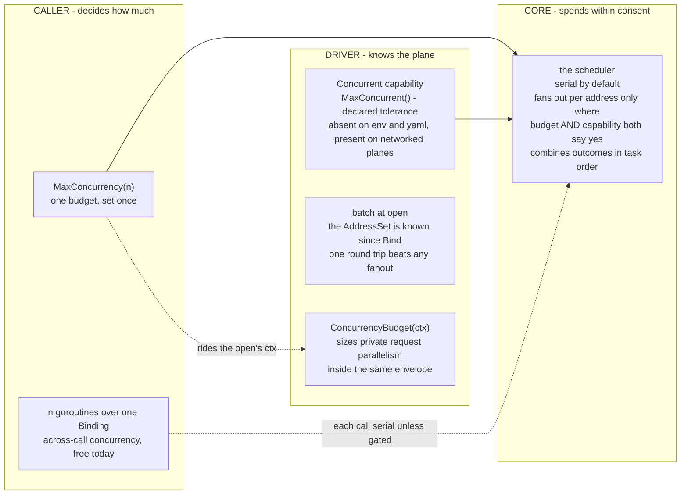
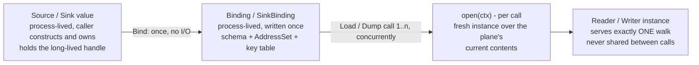

# Concurrency

ferry's concurrency model is layered: the caller decides how much, the driver decides where it pays, and core spends only what both allow.
This page explains the model as approved by the v0 design campaign; the API it describes lands with the concurrency ADR and its implementation.

The whole model is three parties and two consents:

No arrow crosses a boundary uninvited: core writes `go` exactly once, in the scheduler, and only where the caller's budget and the driver's declared tolerance both allow it; the driver spends the same budget privately behind its open, where core never looks.

## The two axes

Concurrency in ferry happens on two different axes, and they are different features.

**Across calls.**
Many Loads or Dumps at once, each walk serial.
This exists today and needs no option: a `Binding` or `SinkBinding` is safe for use from many goroutines, because everything it holds is written once at `Bind` and never again.
Three values loaded from three sources on three goroutines is already fully parallel, and the wall-clock is the slowest single load.

The lifetimes are what make that free:

Everything left of the open is immutable and shared without a lock; everything right of it is minted per call and shared with nobody.
That boundary is why concurrent opens are the driver's published obligation while a single instance never faces concurrency unless it declared the capability.

**Within a call.**
One Load, one plane instance, the walk's per-address I/O overlapped.
This is the axis the rest of this page describes, and it exists only where three parties agree:

- the caller allows it, with the `MaxConcurrency(n)` option;
- the driver's instance offers it, by implementing the optional `Concurrent` capability (`MaxConcurrent() int`);
- core then fans out, bounded by the smaller of the two numbers.

A driver that does not implement `Concurrent` is walked serially no matter what the caller asked for.
`env` and `yaml` never implement it: a file read and a process environment want one call, not eight.
Networked planes implement it because overlap is where their latency goes to die.

## Batching beats fanout

Before reaching for `MaxConcurrency`, know that the bigger win usually belongs to the driver alone.

`Bind` hands every driver the complete `AddressSet` before any I/O happens, so a driver over a batch-capable plane can fetch everything in one round trip at open and serve the whole walk from memory.
Measured in the design campaign's prototype: 40 leaves over a 200µs-per-round-trip plane cost 43.1ms walked serially per key, 5.7ms under an 8-way fanout, and 1.1ms with a single batch fetch at open.
The fanout changes when the round trips happen; only batching changes how many there are.
The kv driver's batch-at-open is the reference implementation of this pattern.

## One budget, both layers

The caller's `MaxConcurrency(n)` is a single budget that both layers honour.

Core's scheduler obeys it when fanning out over a `Concurrent` instance.
The same number rides the open's context, where a driver reads it with `ConcurrencyBudget(ctx)` to size its own request parallelism, for example splitting one service's large batch into concurrent smaller calls.
Whether that split pays is the driver's knowledge: it helps when a service's cost grows with batch size, and it is pure rate-limit pressure when a round trip has flat cost.
No layer can exceed what the caller granted, whichever layer spends it.

## What stays serial

Dump's writes stay serial per address in the walk.
Staging already splits a dump into an encode phase and a flush: the encode is pure CPU, and the flush is where the I/O lives, inside `Commit`, where the driver batches privately within the same budget.

Determinism survives concurrency by construction.
Every subtree of the walk returns one outcome value, and the scheduler combines outcomes and errors in task order, never completion order, so a concurrent walk reports byte-identically to the serial one.
The conformance suite holds any driver that declares `Concurrent` to exactly that equivalence.

## Caller-supplied functions

Options that accept a function, such as `env.Environ` or the kv driver's `Client`, state in their own documentation exactly when the function may be called concurrently.
The contract is static: it follows from the options supplied at `Bind` and the capabilities the driver declares, never from a runtime flag.
The rule of thumb: sharing a binding across goroutines is what makes your callable concurrent, and the sharer is the one who knows.
