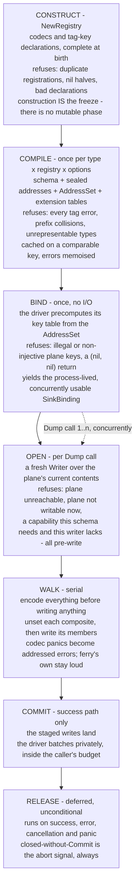

# The dump lifecycle

A `ferry.Dump` call is seven stages, each owned by exactly one party, and every one of them can refuse.
This page is the whole of it in one place: the stage names, the shape end to end, and the refusal ladder that decides which stage a given failure belongs to.

It is the map, not the manual.
[Writing a driver](drivers.md) is where the interfaces and their signatures live, and this page links into it rather than restating it.
The specification is [ADR-0004](../adr/0004-source-and-sink.md) for the contract, [ADR-0006](../adr/0006-defaults-and-zero-values.md) for what a dump says and does not say, and [ADR-0011](../adr/0011-the-error-model.md) for the error model underneath the ladder.

## The seven stages

These are the stage names, and they are the vocabulary the rest of ferry's documentation uses for the same moments.

| stage | happens | owned by | what it produces |
| --- | --- | --- | --- |
| **Construct** | once, at a registry's birth | you | a `*Registry` complete at construction, with no mutable phase after it |
| **Compile** | once per type, registry and option set | core | the schema, the sealed addresses and the `AddressSet`, cached |
| **Bind** | once, no I/O | your driver | the precomputed key table, and a process-lived `SinkBinding` |
| **Open** | per `Dump` call | your driver | a fresh `Writer` over the plane's current contents |
| **Walk** | per `Dump` call, serial | core | every address the value realised, said to the plane |
| **Commit** | on the success path only | your driver | the staged writes made durable |
| **Release** | always, deferred | your driver | the resource let go, on every path |

They are stages, not a grammar.
Grammar is reserved for what a struct tag spells, which is [Tags, defaults and absence](tags.md).

Everything left of the open is written once and shared without a lock.
Everything right of it is minted per call and shared with nobody, which is why concurrent opens are the driver's published obligation while a single `Writer` never faces overlap unless it declared `Concurrent`.
[Concurrency](concurrency.md) is that boundary in full.

## Inside the walk

The walk is four sub-stages, and their order is the order the plane has to see.

| sub-stage | what happens | the driver method |
| --- | --- | --- |
| **Pre-write** | every leaf is encoded and every dynamic address is minted, then the realised set is offered to the plane | `Prepare` |
| **Unset** | each composite the dump writes is retracted, so what follows replaces rather than adds | `Unset` |
| **Write** | each realised address is said, leaves at their own addresses and containers at theirs | `Set`, `Ensure` |
| **Commit** | the staged writes land | `Commit` |

**Pre-write is why a dump that could have failed for free does not touch the plane.**
An encode failure is deterministic and per field, so hoisting it costs the plane nothing.
Over an eight-address struct holding two values with no representation, an interleaved dump writes six addresses for a failure ferry could have known first; this writes none and reports both.

ferry pays for the separate phase only where the sink cannot pay for it itself.
A `Committer` stages already, so `Commit` running only on success leaves the plane untouched on failure regardless, and core interleaves for it instead.
That gives a staging sink a strictly better error set: it learns the plane's refusals and its own unrepresentable values in one run, where a flat sink learns the second only after the first is fixed.
That is a reason to implement `Committer`, stated rather than left as folklore.

**Unset is what makes a dump replace.**
A dump makes the plane's projection of the schema equal exactly what the value renders to, and that is not achievable by writing members alone: a list that lost its tail, or a map that lost a key, leaves residue that loads back with a nil error.
So each composite the dump speaks about is retracted first, and its members are written into the space that leaves.

The stage was called Retract while it was being designed, and its verb is `Unset`, because that is what config vocabulary calls it and because the verb is idempotent by name.

**Unset says nothing about the addresses a dump is silent at.**
Omission is no statement, and the plane is untouched ([ADR-0006](../adr/0006-defaults-and-zero-values.md)).
Replace governs every address the dump speaks about, and no address it is silent at.
That is the symmetric twin of the load-side rule: absence does not write into the struct, and omission does not write into the plane.
It is also why `omitzero` means what its name says - a zero-valued field beside an operator-owned key is silence, not a delete.

**Write says two different things, and they take different methods.**
A leaf's value goes to `Set` at a `LeafAddr`.
What the value has to say at a container's own address - present and holding nothing, or null - goes to `Ensure` at a `Container`, because a plane with no spelling for a container should refuse rather than receive a write it will mis-store.

## The refusal ladder

One invariant runs under every stage above:

> Nothing is refusable later than it is knowable, and nothing is dropped silently, ever.

Each rung names the moment, the sentinel class the failure carries, and the ADR that owns the rule.
The classes are the six in [Errors](errors.md#the-six-sentinels), and `ErrDriver` crosses any of them as provenance when the failure came out of driver code rather than core.

| rung | refuses here | class | owned by |
| --- | --- | --- | --- |
| **Construct** | duplicate codec registrations, a nil half, a duplicate or malformed tag-key declaration | `ErrSchema` | [ADR-0017](../adr/0017-the-registration-api-and-the-value-it-builds.md) |
| **Compile** | every tag error across the three tiers, unrepresentable types, prefix collisions, zero-length arrays, a default that does not parse | `ErrSchema` | [ADR-0008](../adr/0008-the-struct-tag-grammar.md), [ADR-0010](../adr/0010-the-entry-point-and-the-schema-cache.md) |
| **Bind** | a nil sink, an illegal or non-injective plane key, a driver's own bind failure, a `(nil, nil)` return | `ErrPlane` | [ADR-0004](../adr/0004-source-and-sink.md), [ADR-0016](../adr/0016-the-sealed-address-model.md) |
| **Open** | the plane unreachable, a `(nil, nil)` instance, the plane writable in principle but not now, a capability this schema needs and this writer lacks | `ErrPlane`, `ErrReadOnly` | [ADR-0004](../adr/0004-source-and-sink.md) |
| **Pre-write** | a value with no representation on this plane, a minted address that is illegal or collides with another | `ErrValue`, `ErrSchema` | [ADR-0011](../adr/0011-the-error-model.md) |
| **Write** | the plane refusing an address, aggregated flat and sorted rather than stopping at the first; a container the plane cannot spell | `ErrPlane` | [ADR-0004](../adr/0004-source-and-sink.md), [ADR-0011](../adr/0011-the-error-model.md) |
| **Commit** | the plane refusing the landing, and a plane that changed underneath the dump | `ErrPlane` | [ADR-0004](../adr/0004-source-and-sink.md) |
| **Release** | nothing, ever - see below | - | [ADR-0004](../adr/0004-source-and-sink.md) |

Three rules hold across the whole ladder.

**Core trusts a driver on values and never on structure.**
A value the plane supplies is the plane's business, and ferry hands it to the type set.
A structural violation - a child minted under a leaf, a container answered where a leaf was asked - is refused loudly where it is found, mid-walk, because it is the driver contradicting the schema rather than the plane holding something odd.

**A driver is named in its own failure.**
`(nil, nil)` from a `Bind` or an open is illegal state rather than a meaningful one, so core refuses it as an error naming the driver, never as a dereference and never as a panic.

**Release never refuses and never skips.**
It is deferred and unconditional: it runs on success, on error, on cancellation and on panic.
A `Close` failure joins the reported error set rather than replacing it, and closed-without-`Commit` is the abort signal, so no driver is ever told that it failed.

### Where a capability refuses

The two write-side capabilities sit on different rungs, and the difference is deliberate.

`Ensurer` is what the **value** has to say at a container's own address.
A schema can need it and a writer can lack it, and the refusal names the address and the plane.

`Unsetter` is about what the **plane already holds**.
A schema that needs a retraction against a writer that lacks one refuses at **Open**, before any I/O, addressed at the composite: a dump that cannot replace is a dump that will leave residue, and that is knowable the moment the writer is in hand.

That refusal is ahead of `Prepare` and not beside it, which is the ladder's own order rather than a preference.
Whether this schema can need a retraction is knowable from the writer alone, so it belongs to the open; which addresses this value realised is knowable only after every leaf is encoded, so `Prepare` belongs to the pre-write.
A sink that cannot forget an address is therefore never asked to look at a realised set for a dump that was refused before the walk began.

A schema needs one when its address set holds a composite, which is a slice or a map: the one place membership comes from the value rather than from the type, and therefore the one place a plane can be holding a member this dump does not.
A sink that satisfies replace through its `Commit` still declares `Unsetter` - both shipped sinks do, and both do the deletion at commit time - so staging is not an exemption from the capability.

## Panics

A panic out of your own codec is caught at the call into it, arrives in the report as an addressed `ErrPanic`, and its siblings still finish.
A panic ferry itself raises stays a panic, because it is a bug in ferry and should be reported as one.

Neither one skips Release.
That is the whole point of the deferral, and it is the one property no stage above may quietly opt out of.

## Where to go next

- [Writing a driver](drivers.md) - the two required methods, the optional capabilities, and what each stage asks of your code.
- [Errors](errors.md) - the six sentinels, the accessor, and how a failure is matched.
- [Concurrency](concurrency.md) - what overlaps inside one walk, and what the open boundary buys.
- [Tags, defaults and absence](tags.md) - `omitzero`, `default=` and `required`, which decide what a dump speaks about at all.
