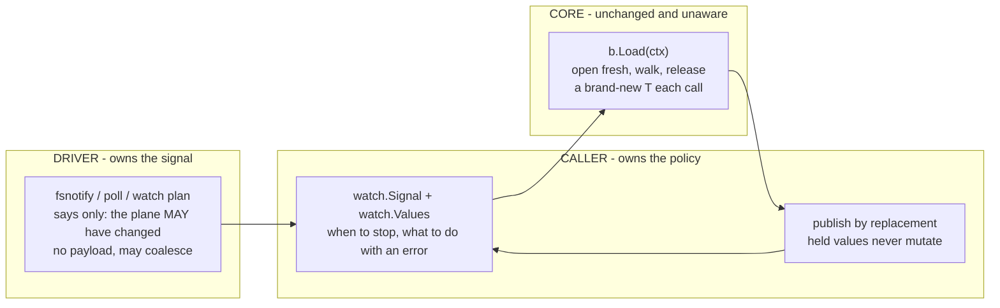
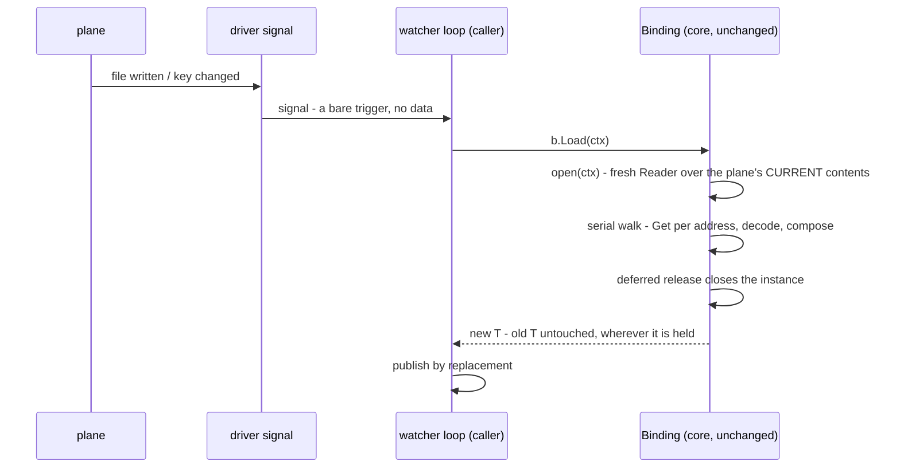

# Watch and reload

ferry ships a watch helper and no watcher, and the difference is the point.
Package [`ferry/watch`](https://pkg.go.dev/github.com/onhotpath/ferry/watch) turns a driver's change callback into a stream of freshly loaded values; what signals a change, how often, and where the new value goes are still yours.
This page is the pattern, and it quotes the runnable `Example`s in `watch/example_test.go`.

## Reload is Load

A reload produces a new value.
Hold a `Binding[T]`, and every call to `Load` opens the plane fresh, walks it, and returns a brand-new `T`; values you handed out earlier never change.
There is no `Reload` method because it would be a second name for `Load`.

`LoadOver` is not the watcher's tool.
It exists to carry a seed forward deliberately, and it has two properties that are wrong for a watch loop:

- an address the plane has lost keeps the seed's value, silently;
- a slice or map is replaced wholesale by whatever the plane holds, never merged, while struct fields carry over individually.

If your loop needs "current config, refreshed", call `Load`.

## The loop

The driver owns the change signal: fsnotify for a file, a poll for another file, a watch plan for Consul.
The helper turns those announcements into fresh values.

Three parties, and only one of them is yours to decide:



Core cannot tell a reload from a first load, and that is the design: bind-once, open-many was built long before watching, and watching is just something driving it on a signal.

`watch.Signal` is the thing a driver announces into.
Its `Changed` method value has type `func(context.Context)`, which is exactly what all three watchable drivers' Options take, so wiring is passing a method value.

```go
s := watch.New()
plane.OnChange(s.Changed) // what a driver's watch option takes

b, err := ferry.Bind[Config](plane)
if err != nil {
	fmt.Println("bind:", err)

	return
}

held, err := b.Load(ctx) // the value this goroutine is holding
if err != nil {
	fmt.Println("load:", err)

	return
}

seq, errf := watch.Values(ctx, s, b)

for cfg := range seq {
	fmt.Printf("reloaded: %s:%d\n", cfg.Host, cfg.Port)

	break // one turn is enough for an example; a server keeps ranging
}

fmt.Printf("held:     %s:%d\n", held.Host, held.Port)
fmt.Println("stream error:", errf())
```

That is `Example` in `watch/example_test.go`, trimmed of its setup, so `go test` compiles and runs it.
The plane it watches is a memory plane, and a real one substitutes its own source built with the driver's watch Option.

`Values` yields nothing until the first change, so load once through the binding for the value to start from - that is what `held` is above.
The alternative is calling `s.Changed(ctx)` before ranging, which opens the stream with the plane's current contents.

The shape is `(iter.Seq[T], func() error)` deliberately ([ADR-0020](../adr/0020-watch-and-reload.md)).
A watch error is a production incident, and this is the shape where discarding it takes a visible `_` at the call site rather than a dropped second range variable.
The convention: the stream ends on the first failed reload or on context cancellation, and the error function answers why, once, after the range exits.

## Recovering from a failed reload

The error ends the stream, and continuing past one is a policy ferry does not pick for you.
Recovery is calling `Values` again on the same `Signal`, which loses nothing: a change that lands while no stream is ranging is pending when the next one opens.

```go
plane.Delete(ferry.At("host")) // the plane loses a required address

for {
	seq, errf := watch.Values(ctx, s, b)
	for cfg := range seq {
		fmt.Println("reloaded:", cfg.Host)

		break // a server would keep ranging until it was told to stop
	}

	err := errf()
	if err == nil || errors.Is(err, context.Canceled) {
		return // the range ended cleanly, or the process is shutting down
	}

	fmt.Println("reload failed, address missing:", errors.Is(err, ferry.ErrMissing))

	plane.Set(ferry.At("host"), ferry.String("db2")) // somebody fixes it
}
```

That is `Example_failedReload` in `watch/example_test.go`, trimmed of its setup.
The load's error passes through untouched, so `errors.Is` against ferry's sentinels answers what went wrong before you decide whether to range again.

What one turn of the loop actually does, and where the change enters:



The signal carries nothing because it needs to carry nothing: the open re-reads the plane, so the reload is correct even when signals were coalesced or spurious.

## The sharp edges

**Publish by replacement.**
A loaded value is yours alone; goroutines holding the previous value keep it unchanged.
Swap an atomic pointer, send on a channel, or replace under a short lock - never write into a struct another goroutine can see.

**There are two contexts, and they should be the same one.**
The driver watches under the context you gave its Option, and `watch.Values` ranges under the context you give it.
Pass one that outlives the driver's and the range waits forever on a signal nothing will fire again; cancel the range's first and the driver keeps watching into a `Signal` nobody reads.
Give both the same context and there is one lifecycle, which is what cancelling it ends.

**`Changed` never blocks, so the driver never waits for you.**
A hand-written callback that loads inline holds the driver's watching goroutine for the length of the reload, and delays its next look at the plane.
`Signal.Changed` records the change and returns, and the reload runs on the goroutine doing the ranging.
The price is one pending slot: a burst is one change, and so is a change that lands while a reload is already running ([ADR-0020](../adr/0020-watch-and-reload.md)).

**A lost watch goes quiet.**
`driver/env` watches with fsnotify, and a watch it loses - the watched directory removed, say - fires the callback one last time and then stops firing.
The stream keeps ranging and quietly stops reloading, because there is nothing left to announce.
Nothing in ferry can see that; the driver's own documentation says which endings it can announce, and a process that must not miss a change reloads on a timer as well.

**A dump feeds your own watcher.**
If the same process dumps to the plane it watches, its own writes fire its own signal.
Coalesce, compare, or mark your own writes; the helper deliberately does not hide this.

**Signals may coalesce and may lie.**
Treat a signal as "the plane may have changed", nothing more.
The reload reads the truth; a spurious wake costs one load and yields a value equal to the last.

**One range per `Signal` at a time.**
Two ranges over one `Signal` share the pending changes out between them rather than each receiving them, and nothing polices it.

## The three drivers that announce changes

Everything above is plane-independent: the policy is yours and the signal is the driver's.
Three first-party drivers have a signal to give, and all three give it as a callback rather than a channel, because there is no `Notifier` interface in core to shape one ([ADR-0020](../adr/0020-watch-and-reload.md) specifies that interface and deliberately does not ship it).

The yaml driver is the one described below.
`driver/env` is the second, and its Option is the same shape with one difference: `env.WatchFiles(ctx, onChange)` takes no interval, because it watches with fsnotify rather than by polling.
It watches every file `env.DotEnv` named, refuses at Bind when no file was named or a directory is not there, and coalesces the burst one save produces into a single call.
[ADR-0020](../adr/0020-watch-and-reload.md) is amended in place with why that driver takes the dependency and this one does not.

`driver/windows` is the third, and `winreg.Watch(ctx, onChange)` is the same shape again, also without an interval, because `RegNotifyChangeKeyValue` has none.
It watches the whole subtree under the key the source was built over, so a change to any value or any subkey beneath it fires the callback and a change elsewhere in the hive does not, and it refuses at Bind when the registry behind the source reports no change of its own.
The one thing it does that the other two do not: a registry notification is armed once and consumed once, so the driver places the next registration before it runs your callback.
That is what makes the guarantee above - a change during a reload is one call afterwards - true here as well as for the other two, where the underlying watch is persistent and gives it for free.
A key that does not exist yet is watched from the nearest key above it, so the save that creates it fires the watch.

The three agree on everything but the mechanism, which is deliberate: callback not channel, no error return, no `Stop`, cancellation rides the context you passed, and the watch opens inside the constructor so a failure has somewhere to go.
Wiring a second watchable source under one binding is not answered here or in the ADR - [#361](https://github.com/onhotpath/ferry/issues/361) is where that question lives.

```go
s := watch.New()

src := yaml.NewSource(path, yaml.Watch(ctx, time.Second, s.Changed))
b, err := ferry.Bind[Config](src)
```

Four things are worth knowing before you wire it up.

**It is opt-in, and the context is the whole lifecycle.**
A source built without the option touches the file only when a load asks it to.
One built with it polls from a goroutine of its own, and cancelling the context you gave is what stops it - there is no `Stop`, because core has no watch lifecycle to hang one from.

**Watching starts before `Bind` returns.**
The option starts looking when the source is built, so a change can land before there is a binding to load through, let alone a stream to range.
The `Signal` is what makes that survivable: it records the change rather than losing it, and the first `Values` opens with that reload.

**Looking is a stat, not fsnotify.**
This driver takes no dependency to watch a file, so the interval is yours to name and a rewrite that lands in the same modification-time tick without changing the file's length is not seen.
`driver/env` and `driver/windows` both make the other choice and pay for it in their `require` blocks.

**A save refuses a file that changed underneath it.**
A dump reads the document, stages a replacement and renames it into place, and an edit landing in that window would be swapped away in silence.
So the commit compares the file against what the open read and reports `ErrPlane` instead, leaving your file as the other writer left it.
Load again, apply the same change to what the file holds now, and save again.
That is optimistic concurrency, it costs one stat on the commit path, and it is [ADR-0020](../adr/0020-watch-and-reload.md)'s answer to a watcher and a dumper in one process.
