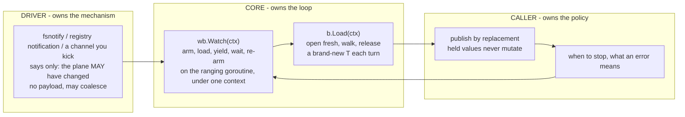

# Watch and reload

Being watchable is a typed fact in ferry, not a flag and not an option.
A driver that can tell you its plane changed publishes a `ferry.WatchableSource`, `ferry.BindWatched` takes only that type, and handing it an ordinary source does not compile.
What comes back is a `ferry.WatchedBinding[T]` that loads like a binding and streams like a watcher, and the stream opens with a load.

This page is the loop and its failure modes.
Every listing on it is taken from code this repository compiles, and what it was taken from is named beside it along with whatever was left out.

## Reload is Load

A reload produces a new value.
Hold a binding, and every call to `Load` opens the plane fresh, walks it, and returns a brand-new `T`; values you handed out earlier never change.
There is no `Reload` method because it would be a second name for `Load`.

`LoadOver` is not the watcher's tool.
It exists to carry a seed forward deliberately, and it has two properties that are wrong for a watch loop:

- an address the plane has lost keeps the seed's value, silently;
- a slice or map is replaced wholesale by whatever the plane holds, never merged, while struct fields carry over individually.

If your loop needs "current config, refreshed", call `Load`.
`Watch` calls `Load`, which is why it is the same answer.

## The loop

Three parties, and only one of them is yours to decide:



Core cannot tell a reload from a first load, and that is the design: bind-once, open-many was built long before watching, and watching is something driving it on a change.

Wiring is one expression per plane, and the conversion sits on the value that already holds the configuration:

```go
wb, err := ferry.BindWatched[config](yaml.NewSource(path).Watched())
if err != nil {
	fmt.Println(err)

	return
}

seq, errf := wb.Watch(ctx)

for cfg := range seq {
	// publish cfg by replacement, and keep ranging
}

if err := errf(); err != nil {
	fmt.Println(err)

	return
}
```

That is `ExampleSource_Watched` in `driver/yaml/example_test.go`, with its setup and the body of the range left out.

Four things fall out of that shape, and each of them used to be the caller's to get right:

- **The stream opens with a load**, so there is no separate first load to write and no change that landed before `Watch` was called to lose.
- **There is one context**, the one you gave `Watch`, and cancelling it ends the driver's mechanism and your range together.
- **No goroutine is started**, by ferry or by the driver's conversion: the reload runs on the goroutine doing the ranging, and there is nothing to stop and nothing to close.
- **The next registration is placed before the reload runs**, so a change that lands while a load is in flight is the next change rather than a lost one ([ADR-0020](../adr/0020-watch-and-reload.md)).

The shape `(iter.Seq[T], func() error)` is ferry's convention for a fallible iterator ([ADR-0020](../adr/0020-watch-and-reload.md)).
A watch error is a production incident, and this is the shape where discarding it takes a visible `_` at the call site rather than a dropped second range variable.
Range `seq` once, then call `errf` after that range has exited; ranging twice, or reading `errf` while a range is still running, races.
A second stream is a second call to `Watch`.

## The errors you can match

There are two surfaces that fail, and `errors.Is` answers at both.

**At `BindWatched`**, before any load and before any goroutine exists:

| what happened | what it carries |
| --- | --- |
| the source is watchable by type and not by configuration - no file named, a registry that reports no changes | `ferry.ErrPlane`, with the driver's own watch sentinel reachable underneath: `env.ErrWatch`, `yaml.ErrWatch`, `winreg.ErrWatch` |
| the source handed over no mechanism and no reason | `ferry.ErrDriver`, because a source that claims a watch and produces nothing has broken the contract |
| no source was named at all | `ferry.ErrPlane` |
| anything `ferry.Bind` refuses - an unsupported type, a bad tag, a plane that cannot take the addresses | exactly what `ferry.Bind` refuses it with |

There is no cross-driver sentinel for the first row on purpose: you know which driver you constructed, so the driver's own sentinel is the one to match ([ADR-0020](../adr/0020-watch-and-reload.md)).

**At the end of a stream**, `errf` reports one of three endings, and they stay distinguishable:

| ending | what it carries |
| --- | --- |
| a reload failed | the load's own error, untouched, so `ferry.ErrMissing` and every other load sentinel matches |
| the context was cancelled | `ctx.Err()`, so `context.Canceled` or `context.DeadlineExceeded` |
| the watch was lost | `ferry.ErrWatchLost`, carrying `ferry.ErrPlane` too, with the plane's own reason underneath both |

Breaking out of the range is a clean ending and `errf` reports nil.

Silence is not one of the endings, which is the whole point of the third row.
A directory removed underneath fsnotify, a registration the registry will not place, a mechanism that has gone away: each of them ends the stream with a reason instead of leaving a healthy-looking process holding stale configuration.
A driver's own documentation says which of its endings it can name.

## Recovering from a failed reload

An error ends the stream, and continuing past one is a policy ferry does not pick for you.
Recovery is calling `Watch` again on the same binding, which rebuilds nothing: the schema is compiled, the source is bound, and the new stream opens with a load of whatever the plane holds now.

```go
seq, errf := wb.Watch(ctx)
for cfg := range seq {
	fmt.Println("loaded:", cfg.Host)

	plane.Delete(ferry.At("host")) // the plane loses a required address
	hup <- syscall.SIGHUP
}

fmt.Println("required address missing:", errors.Is(errf(), ferry.ErrMissing))

plane.Set(ferry.At("host"), ferry.String("db2")) // somebody fixes it

seq, errf = wb.Watch(ctx)
```

That is `ExampleKick_failedReload` in `examples/watcher/example_test.go`, trimmed of its setup.
The load's error passes through untouched, so `errors.Is` against ferry's sentinels answers what went wrong before you decide whether to open another stream.

Deciding is the point.
A missing required address is somebody else's outage and retrying may be right; a tag error is your bug and retrying is a busy loop.

## Reloading on a signal

ferry ships no way to fire a change into a driver's mechanism, and that is deliberate ([ADR-0020](../adr/0020-watch-and-reload.md)).
Anything a caller announces into would have to be minted by ferry, threaded to the source, and then threaded to the bind, which is exactly the loose wiring the typed seam exists to delete.

The seam is open instead, so you write it.
A process that reloads on `SIGHUP` needs a `ferry.Notifier` whose `Change.Wait` reads the signal channel, and a `ferry.WatchableSource` that pairs it with the source to reload:

```go
type Kick struct {
	Source ferry.Source
	On     <-chan os.Signal
}

func (k Kick) Bind(addrs *ferry.AddressSet) (ferry.OpenFunc, error) {
	if k.Source == nil {
		return nil, errors.New("no source to reload")
	}

	return k.Source.Bind(addrs)
}

func (k Kick) Watching() (ferry.Notifier, error) {
	if k.On == nil {
		return nil, errors.New("no channel to reload on")
	}

	return kick{on: k.On}, nil
}

type kick struct{ on <-chan os.Signal }

func (k kick) Notify(context.Context) (ferry.Change, error) { return k, nil }

func (k kick) Wait(ctx context.Context) (bool, error) {
	select {
	case <-ctx.Done():
		return false, nil
	case _, open := <-k.on:
		return open, nil
	}
}

func (kick) Close() error { return nil }
```

That is `Kick` in `examples/watcher/kick.go` with its doc comments left out, and using it is the wiring every other plane uses:

```go
hup := make(chan os.Signal, 1)
signal.Notify(hup, syscall.SIGHUP)

defer signal.Stop(hup)

wb, err := ferry.BindWatched[Config](watcher.Kick{Source: plane, On: hup})
```

That is `Example` in `examples/watcher/example_test.go`, trimmed of its setup.

Four things are worth knowing before you point it at a real process.

**A channel is already armed, which is why this is so short.**
The seam asks that a registration be live from the moment it is placed, so that a change landing between the registration and the wait is reported rather than missed.
A buffered channel gives that for free; an unbuffered one drops a kick that lands while a reload is still running.

**Closing the channel ends the stream under `ferry.ErrWatchLost`**, because a mechanism that has gone away is what that reports.
Cancelling the context is the ending to reach for when the process is shutting down.

**The refusal belongs at `Watching`.**
A `Kick` with no channel is a watch that can never fire, and answering with an error there puts the failure at `BindWatched` where the driver refusals are, rather than in a stream that never yields a second value.

**One mechanism per binding.**
A process that wants `SIGHUP` and a driver's own file watch under one binding has two mechanisms and needs them fanned in, and ferry does not fan them in for you - see below.

An admin endpoint is the same code, sending on that channel itself rather than waiting for the operating system to.

## The sharp edges

**Publish by replacement.**
A loaded value is yours alone; goroutines holding the previous value keep it unchanged.
Swap an atomic pointer, send on a channel, or replace under a short lock - never write into a struct another goroutine can see.

**Coalescing is the driver's, not core's.**
Core does not debounce and takes no settle window, so a burst that arrives as one change is a driver that swallowed its own burst ([ADR-0020](../adr/0020-watch-and-reload.md)).
Both file drivers wait for the file to stop changing before they answer, and the registry driver's notification collapses a burst by being armed once and consumed once.
A driver you write decides for itself, and its own documentation is where that belongs.

**A change is a hint and may lie.**
It carries no payload because it needs none: the reload opens the plane and reads what is there now, so a coalesced or spurious change costs one load and yields a value equal to the last.

**A dump feeds your own watcher.**
If the same process dumps to the plane it watches, its own writes are changes like any other and its own stream reloads them.
Coalesce, compare, or mark your own writes; ferry deliberately does not hide this.
The other half of that story is the other direction: `driver/yaml`'s sink refuses a save over a file that changed since the open, so an edit that landed while you were dumping is an `ErrPlane` rather than a silently swapped-away change.

**Two streams over one binding both see everything.**
Each call to `Watch` places a registration of its own, so two subsystems following one binding do not share changes out between them.
What they must not do is range the same `seq` twice.

**The last value off the stream is not the last state of the plane.**
A stream that has ended stopped reloading, so a process that keeps serving after `errf` returns is serving whatever it held.
That is an alertable condition, and the three endings above are what you alert on.

## The drivers that announce changes

All three first-party watchable drivers agree on the spelling: `Watched()` on the source, no arguments anywhere, because everything the watch needs was already named when the source was built.

| driver | what is watched | refusal at bind |
| --- | --- | --- |
| [`driver/env`](../../driver/env/README.md) | the directories holding the files `env.DotEnv` named, through fsnotify | a source naming no file, under `env.ErrWatch` |
| [`driver/yaml`](../../driver/yaml/README.md) | the directory holding the file, through fsnotify, so a file that does not exist yet is watched too | a source naming no path, under `yaml.ErrWatch` |
| [`driver/windows`](../../driver/windows/winreg/README.md) | the whole subtree under the source's key, through `RegNotifyChangeKeyValue` | a registry that reports no changes of its own, under `winreg.ErrWatch` |

The directory rather than the file, in both file drivers, because an editor and ferry's own sinks replace a file by renaming another over it.

Nothing above is plane-specific: `Watched()` does no I/O in any of them, so what the operating system has an opinion about surfaces when a stream places its first registration, which is still before any value reaches you.

## Making your own driver watchable

Watchability is not a first-party privilege.
A driver in any module becomes watchable by publishing a type that implements `ferry.WatchableSource`, which is `ferry.Source` plus one method:

- `Watching() (ferry.Notifier, error)` hands over the mechanism, or refuses. It does no I/O, so what it refuses is what the source can see without touching the plane, and the refusal lands at `BindWatched`.
- `Notify(ctx) (ferry.Change, error)` places one registration, live from the moment it returns.
- `Change.Wait(ctx) (bool, error)` consumes that registration once: true is a change, false with no error is the watch ending with no reason to give, and an error is the watch ending with one. Core reports both to the caller as `ferry.ErrWatchLost`, so a mechanism need not decide which of them a caller would rather see.
- `Change.Close()` releases it, and core calls it when it re-arms.

Arm once, consume once, is the weakest mechanism a real plane offers, so a loop that is correct against it is correct against a queue that never goes quiet ([ADR-0020](../adr/0020-watch-and-reload.md)).
The invariant that a registration is placed before the reload runs is core's, so a driver never has to re-derive it.

Prove it with one call to `ferrytest.Watchable`, which asserts the whole set: the stream opens with a load, a change reloads, a burst is one reload, a held value never moves, cancellation ends cleanly, a lost watch ends with a reason, and an instance that cannot be watched refuses at the bind.
[The driver guide](drivers.md) covers everything a driver does that is not watching.

## What ferry does not do for you

Each of these is recorded in [ADR-0020](../adr/0020-watch-and-reload.md) with the trigger that would reopen it, rather than as planned work:

- **Fanning in two mechanisms under one binding.** A caller who wants a driver's watch and their own kick, or two planes under one struct, composes the mechanisms themselves; [#361](https://github.com/onhotpath/ferry/issues/361) is where that question lives.
- **Reaching the plain binding inside a watched one.** `WatchedBinding[T]` loads and streams, and there is no accessor handing out the `Binding[T]` underneath.
- **Per-watch options, including a debounce.** `Watch` takes a context and nothing else.
- **A core convenience for the operator kick.** The section above is the answer, and it is yours to write.

## Where this is decided

[ADR-0020](../adr/0020-watch-and-reload.md) carries the whole argument: the six principles the surface is judged against, why the announcement seam is armed once and consumed once, why the stream ends observably, and what every deferral above is waiting for.
