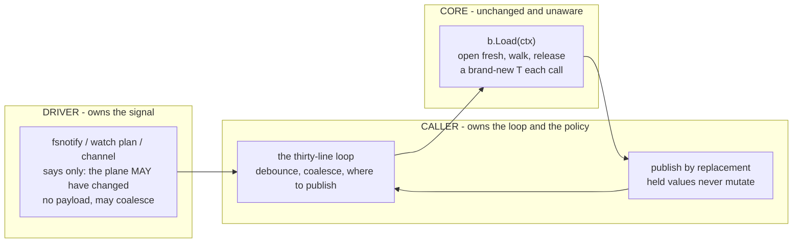
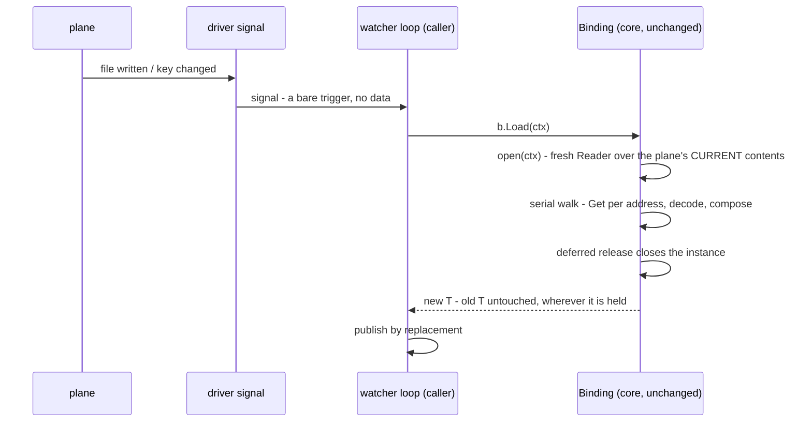

# Watch and reload

ferry ships no watcher, and that is a decision, not a gap.
Everything a watcher needs is already exported, a complete watcher is about thirty lines, and the parts ferry cannot know - what signals a change, how to debounce it, where to publish the new value - are yours.
This page is the pattern; the runnable version lives in `examples/watcher` and is what this page quotes.

## Reload is Load

A reload produces a new value.
Hold a `Binding[T]`, and every call to `Load` opens the plane fresh, walks it, and returns a brand-new `T`; values you handed out earlier never change.
There is no `Reload` method because it would be a second name for `Load`.

`LoadOver` is not the watcher's tool.
It exists to carry a seed forward deliberately, and it has two properties that are wrong for a watch loop:

- an address the plane has lost keeps the seed's value, silently;
- a slice or map is replaced wholesale by whatever the plane holds, never merged, while struct fields carry over individually.

If your loop needs "current config, refreshed", call `Load`.

## The loop

The driver owns the change signal: fsnotify for a file, a watch plan for Consul, a channel in a test.
The loop turns signals into fresh values.

Three parties, and only one of them is yours to write:



Core cannot tell a reload from a first load, and that is the design: bind-once, open-many was built long before watching, and watching is just a caller driving it on a signal.

```go
func Watch[T any](ctx context.Context, b *ferry.Binding[T], signal <-chan struct{}) (seq iter.Seq[T], errf func() error) {
	var streamErr error
	seq = func(yield func(T) bool) {
		streamErr = stream(ctx, b, signal, yield)
	}
	return seq, func() error { return streamErr }
}

// stream is the loop itself, returning the error that ended it: nil when the
// driver closed the signal or the caller stopped ranging.
func stream[T any](ctx context.Context, b *ferry.Binding[T], signal <-chan struct{}, yield func(T) bool) error {
	for {
		v, ok, err := reload(ctx, b, signal)
		if err != nil {
			return err
		}
		if !ok || !yield(v) {
			return nil
		}
	}
}

// reload waits for one signal and loads through the binding.
//
// ok is false with a nil error for the one clean ending it can see, which is
// the driver closing the signal. A cancelled context and a failed load are both
// errors, and both end the stream.
func reload[T any](ctx context.Context, b *ferry.Binding[T], signal <-chan struct{}) (v T, ok bool, err error) {
	var zero T
	select {
	case <-ctx.Done():
		return zero, false, ctx.Err()
	case _, open := <-signal:
		if !open {
			return zero, false, nil
		}
	}
	v, err = b.Load(ctx)
	if err != nil {
		return zero, false, err
	}
	return v, true, nil
}
```

The shape is `(iter.Seq[T], func() error)` deliberately.
A watch error is a production incident, and this is the shape where discarding it takes a visible `_` at the call site rather than a dropped second range variable.
The convention: the stream ends on the first failed reload or on context cancellation, and the error function answers why, once, after the range exits.

```go
seq, errf := Watch(ctx, binding, signal)
for cfg := range seq {
	publish(cfg) // replace the pointer, never mutate the old value
}
if err := errf(); err != nil {
	alert(err)
}
```

What one turn of the loop actually does, and where the change enters:



The signal carries nothing because it needs to carry nothing: the open re-reads the plane, so the reload is correct even when signals were coalesced or spurious.

## The sharp edges

**Publish by replacement.**
A loaded value is yours alone; goroutines holding the previous value keep it unchanged.
Swap an atomic pointer, send on a channel, or replace under a short lock - never write into a struct another goroutine can see.

**A dump feeds your own watcher.**
If the same process dumps to the plane it watches, its own writes fire its own signal.
Coalesce, compare, or mark your own writes; the loop above deliberately does not hide this.

**Signals may coalesce and may lie.**
Treat a signal as "the plane may have changed", nothing more.
The reload reads the truth; a spurious wake costs one load.

**yaml specifics.**
File watching for the yaml driver is opt-in through a driver option, and a dump refuses at commit when the file changed underneath it between open and swap, so the dump that lost a race learns it lost instead of silently overwriting; re-dump after reloading.
