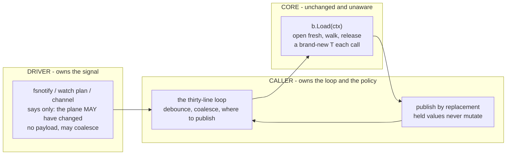
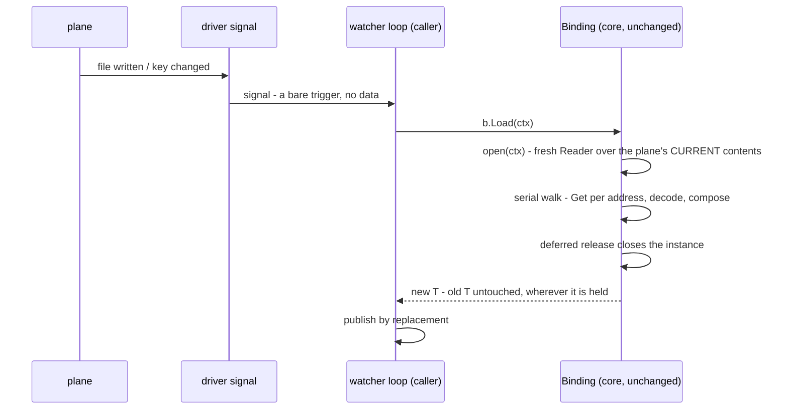

# Watch and reload

ferry ships no watcher, and that is a decision, not a gap.
Everything a watcher needs is already exported, a complete watcher is about thirty lines, and the parts ferry cannot know - what signals a change, how to debounce it, where to publish the new value - are yours.
This page is the pattern; the runnable version lives in `examples/watcher` and is what this page quotes.

## Reload is Load

A reload produces a new value.
Hold a `Binding[T]`, and every call to `Load` opens the plane fresh, walks it, and returns a brand-new `T`; values you handed out earlier never change.
There is no `Reload` method because it would be a second name for `Load`.

`LoadOver` is not the watcher's tool.
It exists to carry a seed forward deliberately, and it has two properties that are wrong for a watch loop:

- an address the plane has lost keeps the seed's value, silently;
- a slice or map is replaced wholesale by whatever the plane holds, never merged, while struct fields carry over individually.

If your loop needs "current config, refreshed", call `Load`.

## The loop

The driver owns the change signal: fsnotify for a file, a watch plan for Consul, a channel in a test.
The loop turns signals into fresh values.

Three parties, and only one of them is yours to write:



Core cannot tell a reload from a first load, and that is the design: bind-once, open-many was built long before watching, and watching is just a caller driving it on a signal.

```go
func Watch[T any](
	ctx context.Context, b *ferry.Binding[T], signal <-chan struct{},
) (seq iter.Seq[T], errf func() error) {
	var streamErr error
	seq = func(yield func(T) bool) {
		streamErr = stream(ctx, b, signal, yield)
	}
	return seq, func() error { return streamErr }
}

// stream is the loop itself, returning the error that ended it: nil when the
// driver closed the signal or the caller stopped ranging.
func stream[T any](ctx context.Context, b *ferry.Binding[T], signal <-chan struct{}, yield func(T) bool) error {
	for {
		v, ok, err := reload(ctx, b, signal)
		if err != nil {
			return err
		}
		if !ok || !yield(v) {
			return nil
		}
	}
}

// reload waits for one signal and loads through the binding.
//
// ok is false with a nil error for the one clean ending it can see, which is
// the driver closing the signal. A cancelled context and a failed load are both
// errors, and both end the stream.
func reload[T any](ctx context.Context, b *ferry.Binding[T], signal <-chan struct{}) (v T, ok bool, err error) {
	var zero T
	select {
	case <-ctx.Done():
		return zero, false, ctx.Err()
	case _, open := <-signal:
		if !open {
			return zero, false, nil
		}
	}
	v, err = b.Load(ctx)
	if err != nil {
		return zero, false, err
	}
	return v, true, nil
}
```

The shape is `(iter.Seq[T], func() error)` deliberately.
A watch error is a production incident, and this is the shape where discarding it takes a visible `_` at the call site rather than a dropped second range variable.
The convention: the stream ends on the first failed reload or on context cancellation, and the error function answers why, once, after the range exits.

```go
seq, errf := Watch(ctx, binding, signal)
for cfg := range seq {
	publish(cfg) // replace the pointer, never mutate the old value
}
if err := errf(); err != nil {
	alert(err)
}
```

What one turn of the loop actually does, and where the change enters:



The signal carries nothing because it needs to carry nothing: the open re-reads the plane, so the reload is correct even when signals were coalesced or spurious.

## The sharp edges

**Publish by replacement.**
A loaded value is yours alone; goroutines holding the previous value keep it unchanged.
Swap an atomic pointer, send on a channel, or replace under a short lock - never write into a struct another goroutine can see.

**A dump feeds your own watcher.**
If the same process dumps to the plane it watches, its own writes fire its own signal.
Coalesce, compare, or mark your own writes; the loop above deliberately does not hide this.

**Signals may coalesce and may lie.**
Treat a signal as "the plane may have changed", nothing more.
The reload reads the truth; a spurious wake costs one load.

## The three drivers that announce changes

Everything above is plane-independent: the loop is yours and the signal is the driver's.
Three first-party drivers have a signal to give, and all three give it as a callback rather than a channel, because there is no `Notifier` interface in core to shape one ([ADR-0020](../adr/0020-watch-and-reload.md) specifies that interface and deliberately does not ship it).

The yaml driver is the one described below.
`driver/env` is the second, and its Option is the same shape with one difference: `env.WatchFiles(ctx, onChange)` takes no interval, because it watches with fsnotify rather than by polling.
It watches every file `env.DotEnv` named, refuses at Bind when no file was named or a directory is not there, and coalesces the burst one save produces into a single call.
[ADR-0020](../adr/0020-watch-and-reload.md) is amended in place with why that driver takes the dependency and this one does not.

`driver/windows` is the third, and `winreg.Watch(ctx, onChange)` is the same shape again, also without an interval, because `RegNotifyChangeKeyValue` has none.
It watches the whole subtree under the key the source was built over, so a change to any value or any subkey beneath it fires the callback and a change elsewhere in the hive does not, and it refuses at Bind when the registry behind the source reports no change of its own.
The one thing to know that the other two do not have: your own dump through a `winreg.Sink` over the same key fires your own watcher, and nothing in the driver suppresses that.

The three agree on everything but the mechanism, which is deliberate: callback not channel, no error return, no `Stop`, cancellation rides the context you passed, and the watch opens inside the constructor so a failure has somewhere to go.
Wiring a second watchable source under one binding is not answered here or in the ADR - [#361](https://github.com/onhotpath/ferry/issues/361) is where that question lives.

```go
onChange := func(ctx context.Context) {
	cfg, err := b.Load(ctx) // a reload is a load
	if err != nil {
		alert(err)
		return
	}
	current.Store(&cfg) // publish by replacement
}

src := yaml.NewSource(path, yaml.Watch(ctx, time.Second, onChange))
b, err := ferry.Bind[Config](src)
```

Four things are worth knowing before you wire it up.

**It is opt-in, and the context is the whole lifecycle.**
A source built without the option touches the file only when a load asks it to.
One built with it polls from a goroutine of its own, and cancelling the context you gave is what stops it - there is no `Stop`, because core has no watch lifecycle to hang one from.

**Watching starts before `Bind` returns.**
The option starts looking when the source is built, so a callback that loads through the binding is referring to a variable the surrounding code has not assigned yet.
Publish the binding through something that orders the two - an atomic pointer, or a channel the callback reads first - which is what `ExampleWatch` in `driver/yaml` does.

**Looking is a stat, not fsnotify.**
This driver takes no dependency to watch a file, so the interval is yours to name and a rewrite that lands in the same modification-time tick without changing the file's length is not seen.
`driver/env` and `driver/windows` both make the other choice and pay for it in their `require` blocks.

**A save refuses a file that changed underneath it.**
A dump reads the document, stages a replacement and renames it into place, and an edit landing in that window would be swapped away in silence.
So the commit compares the file against what the open read and reports `ErrPlane` instead, leaving your file as the other writer left it.
Load again, apply the same change to what the file holds now, and save again.
That is optimistic concurrency, it costs one stat on the commit path, and it is [ADR-0020](../adr/0020-watch-and-reload.md)'s answer to a watcher and a dumper in one process.
